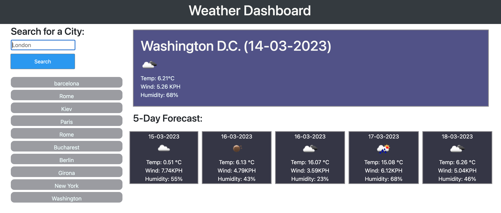

# Weather Dashboard App
This app is a weather dashboard that allows users to search for the weather forecast of a specific location. The app uses the OpenWeatherMap API to retrieve the forecast data.

## Usage
When the page loads, the app will populate the history list from local storage. Users can click on a location from the history list to search for the weather forecast of that location again.

To search for a new location, users can enter a city namein the search bar and hit the "search" button or press enter. The app will call the OpenWeatherMap API to find the latitude and longitude of the location and retrieve the weather forecast data for the next 5 days.

The app will display today's weather data in a container for today's weather, and the 5-day forecast data in a container for the 5-day forecast. The app also saves the searched locations to local storage for easy access later.

## How to Run
To run the app, you need to have an API key from OpenWeatherMap. You can get one for free from their website. Once you have the API key, you can clone or download the project from the repository.

After you have the project on your local machine, open the index.html file in your browser. Enter a city name or a zip code in the search bar, and hit the "search" button or press enter. The app will display the weather forecast data for the next 5 days.

## Dependencies
The app uses jQuery and Moment.js libraries, as well as the OpenWeatherMap API to retrieve the forecast data.

## Contributing
Contributions are welcome. Please open an issue or pull request for any bugs or feature requests.

## License
This project is licensed under the MIT License.